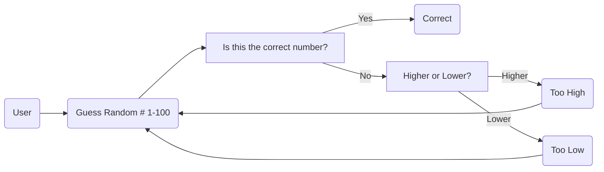

```mermaid
flowchart LR
%% Number guessing game%%
%% 1. The user goes and guess a random number 1-100
%% 2. The user checks to see if the number thry have guessed is correct
%% 3. If they guess the correct number then that is the end ogf the game
%% 4. if the number is not correct they then guess if the number is higher or lower
%% 5. If the number is too high or too low they are redirected to guess another number
%% 6. then the cycle continues until they guess the correct number.
    U(User) --> G(Guess Random # 1-100)
    G --> D[Is this the correct number?]
    D -->|Yes| C(Correct)
    D -->|No| F[Higher or Lower?]
    F -->|Higher| TH(Too High) --> G
    F -->|Lower| TL(Too Low) --> G

```
### This a flowchart of a number guessing game
